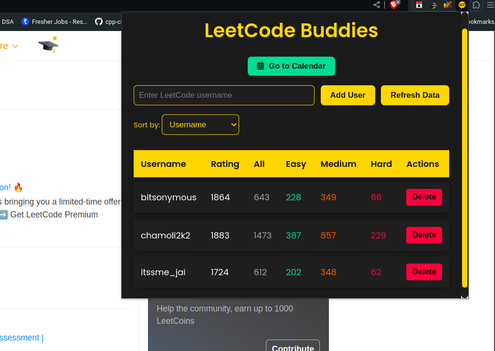
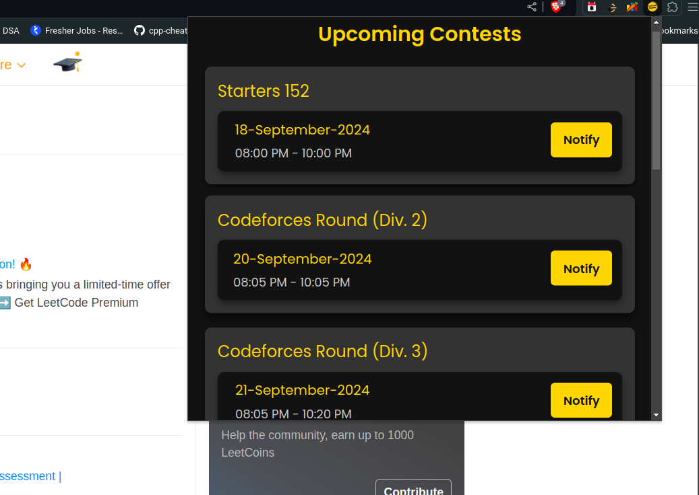

#  LeetCode Buddies

> Browser extension that allows you to compare LeetCode profiles and track upcoming coding contests from LeetCode, CodeChef, and Codeforces.

## Installation Instructions

1. Download the [latest release](https://github.com/bitsonymous/LeetCode_Buddies/releases).
2. Unzip the downloaded file.
3. Open Browser and go to `browser://extensions/`.
4. Enable **Developer mode** (top-right corner).
5. Click **Load unpacked** and select the unzipped folder.
6. Your extension will now be installed!

We built this extension to simplify the comparison of LeetCode profiles and to keep track of upcoming contests across multiple platforms. 

## Supported Browsers:

    
    
    
    

## Tech Stack

- **Backend:**
      

          
          
      

- **Frontend:**

     

        
        
        
    

    
## Screenshots

### LeetCode Profile Comparison

### Upcoming Contests Tracker

